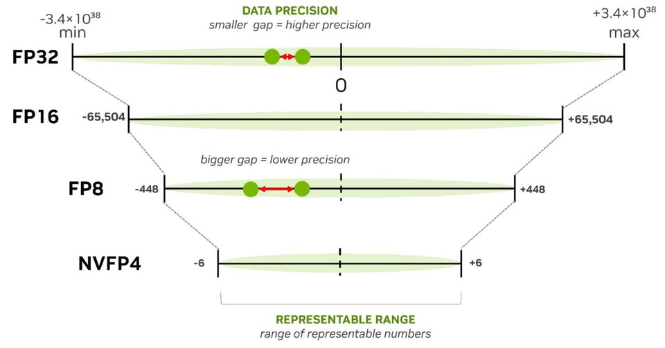

- Lĩnh vực nói chung của đồ án đang liên quan đến việc là

  - Processing-In-Memory (PIM)
  - Near-Data-Processing (NDP)

# Kiến trúc Processing-in-DRAM (PIM)

- **Nguyên lý:** Tích hợp các đơn vị tính toán nhỏ (ALU đơn giản) ngay bên trong chip DRAM hoặc tại lớp logic (logic layer) của các bộ nhớ 3D-stacked như HBM (High Bandwidth Memory).

https://developer.nvidia.com/blog/top-5-ai-model-optimization-techniques-for-faster-smarter-inference/?ncid=so-face-272978&fbclid=IwY2xjawO56k1leHRuA2FlbQIxMABicmlkETFWM1QwUGxFYmV0M0V5NUl5c3J0YwZhcHBfaWQQMjIyMDM5MTc4ODIwMDg5MgABHsSCEznPgUZgKK4cQTk90AkE5MiNN6RL0wksmx3v2ID8GUWNvYLR0fD2_RYO_aem_Uu1uIGZJL1joTXFshavyYg

