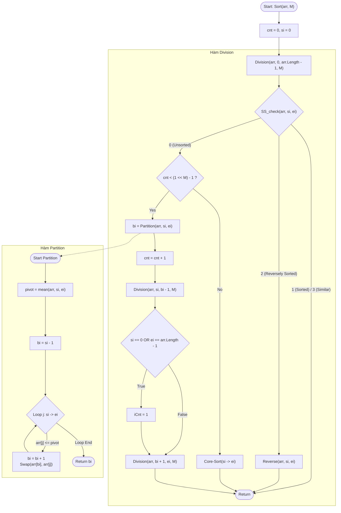

```mermaid
    flowchart TD
    %% Main Flow
    Start(["Start: Sort(arr, M)"]) --> Init["cnt = 0, si = 0"]
    Init --> CallDiv["Division(arr, 0, arr.Length - 1, M)"]

    %% Division Function Subgraph
    subgraph DivisionFunc [Hàm Division]
        direction TB
        CallDiv --> CheckSS{"SS_check(arr, si, ei)"}
        
        %% SS_Check Branches
        CheckSS -- "1 (Sorted) / 3 (Similar)" --> Ret1(["Return"])
        CheckSS -- "2 (Reversely Sorted)" --> Rev["Reverse(arr, si, ei)"]
        Rev --> Ret1
        
        CheckSS -- "0 (Unsorted)" --> CheckCnt{"cnt < (1 << M) - 1 ?"}
        
        %% Recursion Limit Check
        CheckCnt -- No --> CoreSort["Core-Sort(si -> ei)"]
        CoreSort --> Ret1
        
        CheckCnt -- Yes --> Part["bi = Partition(arr, si, ei)"]
        Part --> IncCnt["cnt = cnt + 1"]
        
        %% Recursive Calls
        IncCnt --> RecLeft["Division(arr, si, bi - 1, M)"]
        RecLeft --> CheckBound{"si == 0 OR ei == arr.Length - 1"}
        
        CheckBound -- True --> SetICnt["iCnt = 1"]
        CheckBound -- False --> RecRight
        SetICnt --> RecRight["Division(arr, bi + 1, ei, M)"]
        
        RecRight --> Ret1
    end

    %% Partition Function Subgraph
    subgraph PartFunc [Hàm Partition]
        direction TB
        PStart(["Start Partition"]) --> PPivot["pivot = mean(arr, si, ei)"]
        PPivot --> PInit["bi = si - 1"]
        PInit --> PLoop{"Loop j: si -> ei"}
        
        PLoop -- "arr[j] <= pivot" --> PSwap["bi = bi + 1\nSwap(arr[bi], arr[j])"]
        PSwap --> PLoop
        
        PLoop -- "Loop End" --> PRet(["Return bi"])
    end
    
    %% Visual connection (Dashed line)
    Part -.-> PStart
```